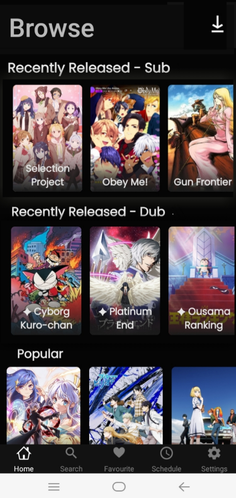
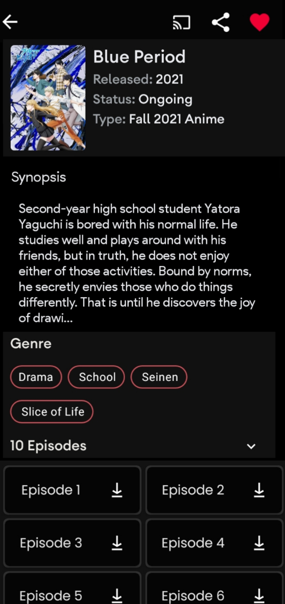
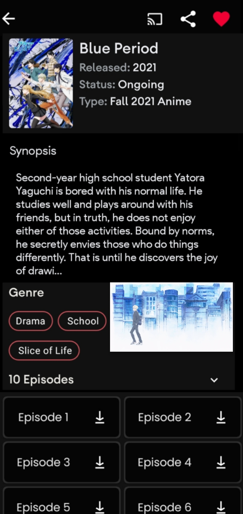
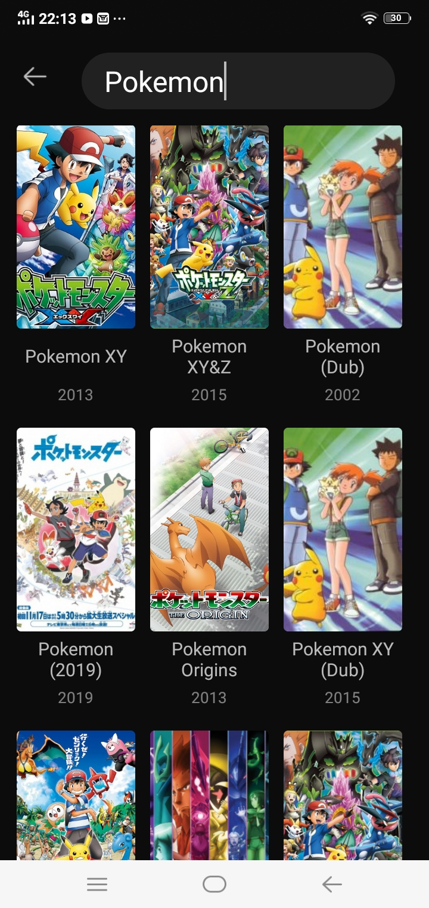
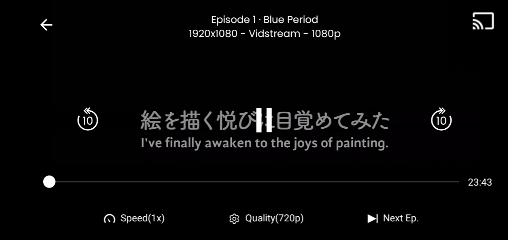

<h2 align="center"><b>AniYuri</b></h2>

<h4 align="center">An Android and IOS app to watch anime on your phone without ads.</h4>

<h5 align="center">51 percent Completely</h5>

<h5 align="center">Download soon...</h5>

## Screenshots

## Features

- Recent Anime Release.
- Popular Anime.
- Search Anime. 
- WhatAnime (photo search anime)
- Anime Schedule.
- Top Airing Anime.
- Anime Movies.
- Download Anime.
- Automatic Download Anime.
- Dark & Light Moade
- Add to favorites.
- Sign into My Anime List.
- Auto Quality for Video Playback.
- Directly skip to next/previous episode from player.
- Update MAL list.
- FanDub Anime
- Ad free

## Site used
- Gogoanime.pe
- animepahe.com
- anilist.co
- other anime fan dub site

## Technologies used
- Kotlin
- Dart
- MVVM
- Retrofit & Coroutines
- ExoPlayer
- Javascript
- Android Architecture Components
- Coil

## Credit By AnimeXStream
I use AnimeXStream Source Code

